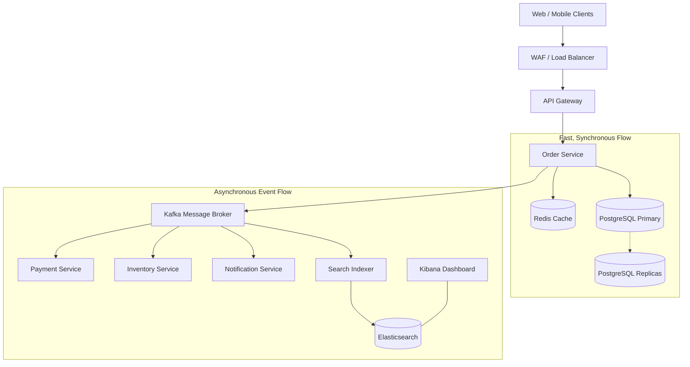

# 🛒 High-Availability Order Management System (OMS)

## 1. Requirements & Capacity Planning
* **Volume:** 100,000 orders/day.
* **Throughput:** Average ~1.2 Orders/Second. Peak Load (e.g., Black Friday) ~50-100 Orders/Second.
* **Availability:** 99.99% (Highly Available, no single point of failure).
* **Data Guarantee:** Strong consistency is required for financial transactions and inventory.

---

## 2. High-Level Architecture

---

## 3. The Order Creation Flow

To achieve high availability and prevent crashes during peak traffic, we separate the flow into **Synchronous** (must happen instantly) and **Asynchronous** (can happen a few seconds later).

### Phase 1: Synchronous (Fast Response to User)
1. **API Request:** User hits the "Place Order" button.
2. **Idempotency Check:** The API Gateway checks Redis to ensure this exact request hasn't been submitted twice (preventing double billing).
3. **Order Creation:** The Order Service creates the order with a status of `PENDING` in the **PostgreSQL** database.
4. **Publish Event:** The Order Service publishes an `OrderCreated` event to **Kafka**.
5. **Acknowledge:** The user immediately receives a "Your order is being processed" message.

### Phase 2: Asynchronous (Heavy Lifting)
1. **Inventory Deduction:** The `Inventory Service` listens to Kafka, checks inventory, and reserves the items.
2. **Payment Processing:** The `Payment Service` listens to Kafka, charges the credit card, and emits a `PaymentSuccessful` event.
3. **Status Update:** The Order Service listens for success events and updates the DB status to `CONFIRMED`.
4. **Notification:** The `Notification Service` sends the user a confirmation email.

> [!TIP]
> **Why Asynchronous?** If the Payment Gateway goes down, the Order Service doesn't crash. The system continues to accept `PENDING` orders, and Kafka will hold them safely until the Payment Service comes back online to process them.

---

## 4. Technology Choices & Justification

### Database: PostgreSQL
* **Why:** Orders require ACID compliance (Atomicity, Consistency, Isolation, Durability). You cannot lose financial data or suffer from "eventual consistency" anomalies.
* **High Availability:** Use a Primary node for writes (`INSERT/UPDATE` orders) and multiple Read Replicas for serving read requests (e.g., user checking their order history).

### Message Broker: Apache Kafka (or RabbitMQ)
* **Why:** Decouples microservices. Kafka is highly durable and can store millions of events if downstream services (like Notifications) crash.

### Caching: Redis
* **Why:** Extremely fast. Used to cache user sessions, product catalogs, and distributed locks (preventing two people from buying the last item in stock at the exact same millisecond).

### Search & Analytics: Elasticsearch & Kibana
* **Why:** PostgreSQL is not designed for complex, full-text searching or massive data aggregations.
* **How it works:** Order events are streamed from Kafka directly into **Elasticsearch**. **Kibana** sits on top to provide a real-time visual dashboard. This allows Customer Service agents to instantly search for "John Doe" across millions of orders, and allows engineers to monitor system health (the ELK stack).

---

## 5. Ensuring High Availability (HA)

To ensure the system never goes down:

1. **Auto-Scaling:** Deploy the Order Service on Kubernetes. Configure it to spin up 10x more container instances automatically if CPU usage spikes during a sale.
2. **Multi-AZ Deployment:** Deploy servers and databases across at least 3 Availability Zones (e.g., AWS us-east-1a, 1b, 1c). If an entire data center catches fire, traffic instantly routes to the surviving zones.
3. **Circuit Breakers:** Implement the Circuit Breaker pattern. If a 3rd-party shipping API takes 30 seconds to respond, the circuit breaker "trips" and returns a cached or default response immediately so the whole OMS doesn't grind to a halt.
4. **Database Failover:** If the PostgreSQL Primary dies, the database cluster should automatically promote a Read Replica to become the new Primary within seconds.

---

## 6. Edge Cases Handled
* **The "Last Item" Race Condition:** Handled using database row-level locking (`SELECT ... FOR UPDATE`) or Redis distributed locks.
* **Double Clicks (Idempotency):** Every order request generates a unique "Idempotency Key" on the frontend. If the user clicks "Buy" 5 times rapidly, the backend sees the same key in Redis and ignores the duplicates.
